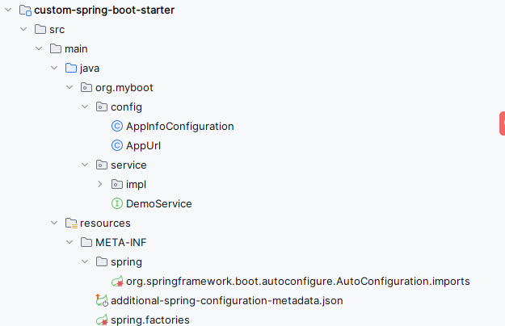
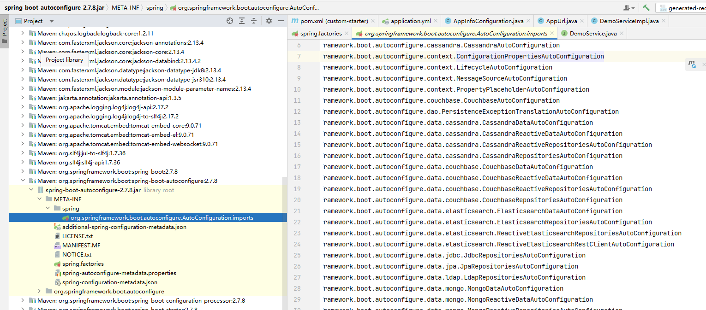
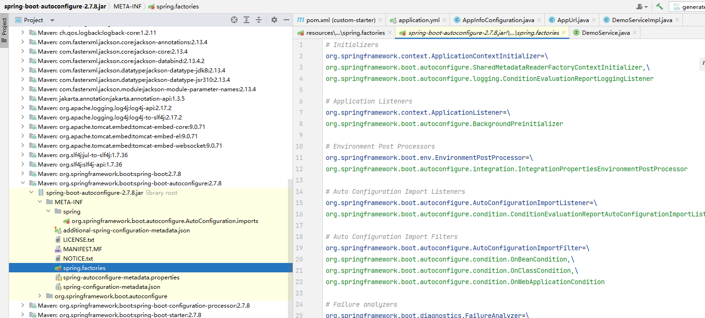

# SpringBoot 2.7.x 自定义 Starter

（3.x版本不再使用 spring.factories做自动配置）

在 2.7.x 版本。只是向下兼容了 spring.factories 的配置方式。

也就是说两种写法共存，如下图：



在 `META-INF` 目录下增加了 spring
目录，其中有文件 `org.springframework.boot.autoconfigure.AutoConfiguration.imports`

文件内容是配置类的完整类名。

比如我当前使用的配置内容是：

```
org.myboot.config.AppInfoConfiguration
```

而 spring.factories 中的配置内容和之前一致：

```
org.springframework.boot.autoconfigure.EnableAutoConfiguration=org.myboot.config.AppInfoConfiguration
```

这一点其实也可以从 Spring 的源码包中看到：





## 代码简要说明

| 模块                         | 说明                                        |
|----------------------------|-------------------------------------------|
| custom-spring-boot-starter | 自定义的 starter，并提供配置、示例接口&实现类               |
| test                       | 测试自定义starter，引入自定义starter的依赖，并定义了启动类，控制器类 |
| tsinglink-common           | 自定义模块，包含一个levelDB 工具                      |

### my-custom-springboot-starter-demo 的pom文件

主要定义了 SpringBoot的版本。

```xml

<project xmlns="http://maven.apache.org/POM/4.0.0" xmlns:xsi="http://www.w3.org/2001/XMLSchema-instance"
  xsi:schemaLocation="http://maven.apache.org/POM/4.0.0 http://maven.apache.org/xsd/maven-4.0.0.xsd">
  <modelVersion>4.0.0</modelVersion>

  <groupId>org.example</groupId>
  <artifactId>my-custom-springboot-starter-demo</artifactId>
  <version>1.0-SNAPSHOT</version>
  <packaging>pom</packaging>

  <name>custom-springboot-starter-demo</name>
  <url>https://hqqich.github.io</url>
  <modules>
    <module>custom-spring-boot-starter</module>
    <module>test</module>
    <module>tsinglink-common</module>
  </modules>

  <properties>
    <java.version>1.8</java.version>
    <maven.compiler.source>1.8</maven.compiler.source>
    <maven.compiler.target>1.8</maven.compiler.target>
    <project.build.sourceEncoding>UTF-8</project.build.sourceEncoding>
    <project.reporting.outputEncoding>UTF-8</project.reporting.outputEncoding>
    <project.build.sourceEncoding>UTF-8</project.build.sourceEncoding>
    <springboot.dependencies.version>2.7.8</springboot.dependencies.version>
  </properties>

  <dependencyManagement>
    <dependencies>
      <!-- https://mvnrepository.com/artifact/org.springframework.boot/spring-boot-dependencies -->
      <dependency>
        <groupId>org.springframework.boot</groupId>
        <artifactId>spring-boot-dependencies</artifactId>
        <version>${springboot.dependencies.version}</version>
        <type>pom</type>
        <scope>import</scope>
      </dependency>
    </dependencies>
  </dependencyManagement>

  <build>
    <pluginManagement>
      <plugins>
        <plugin>
          <groupId>org.apache.maven.plugins</groupId>
          <artifactId>maven-compiler-plugin</artifactId>
          <version>3.8.1</version>
          <configuration>
            <source>1.8</source>
            <target>1.8</target>
            <encoding>UTF-8</encoding>
          </configuration>
        </plugin>
      </plugins>
    </pluginManagement>

    <plugins>
      <plugin>
        <groupId>org.apache.maven.plugins</groupId>
        <artifactId>maven-compiler-plugin</artifactId>
        <version>3.8.1</version>
        <configuration>
          <source>1.8</source>
          <target>1.8</target>
          <encoding>UTF-8</encoding>
        </configuration>
      </plugin>
    </plugins>
  </build>
</project>

```

### custom-spring-boot-starter 的pom文件

```xml

<project xmlns="http://maven.apache.org/POM/4.0.0" xmlns:xsi="http://www.w3.org/2001/XMLSchema-instance"
  xsi:schemaLocation="http://maven.apache.org/POM/4.0.0 http://maven.apache.org/xsd/maven-4.0.0.xsd">
  <modelVersion>4.0.0</modelVersion>
  <parent>
    <groupId>org.example</groupId>
    <artifactId>my-custom-springboot-starter-demo</artifactId>
    <version>1.0-SNAPSHOT</version>
  </parent>

  <artifactId>custom-spring-boot-starter</artifactId>
  <packaging>jar</packaging>

  <name>custom-spring-boot-starter</name>
  <url>https://hqqich.github.io</url>

  <dependencies>
    <dependency>
      <groupId>org.springframework.boot</groupId>
      <artifactId>spring-boot-starter</artifactId>
    </dependency>

    <dependency>
      <groupId>org.springframework.boot</groupId>
      <artifactId>spring-boot-configuration-processor</artifactId>
      <optional>true</optional>
    </dependency>
  </dependencies>

  <build>
    <!-- 将自定义starter中的默认配置文件也打包 -->
    <resources>
      <resource>
        <directory>src/main/resources</directory>
        <includes>
          <include>**/*.properties</include>
          <include>**/*.yml</include>
          <include>**/*.yaml</include>
          <include>**/*.json</include>
          <include>**/*.imports</include>
        </includes>
        <filtering>false</filtering>
      </resource>
    </resources>
  </build>
</project>
```

### test 的pom文件

```xml

<project xmlns="http://maven.apache.org/POM/4.0.0" xmlns:xsi="http://www.w3.org/2001/XMLSchema-instance"
  xsi:schemaLocation="http://maven.apache.org/POM/4.0.0 http://maven.apache.org/xsd/maven-4.0.0.xsd">
  <modelVersion>4.0.0</modelVersion>
  <parent>
    <groupId>org.example</groupId>
    <artifactId>my-custom-springboot-starter-demo</artifactId>
    <version>1.0-SNAPSHOT</version>
  </parent>

  <artifactId>test</artifactId>
  <packaging>jar</packaging>

  <name>test</name>
  <url>https://www.tsinglink.com</url>


  <dependencies>
    <dependency>
      <groupId>org.springframework.boot</groupId>
      <artifactId>spring-boot-starter-web</artifactId>
    </dependency>

    <!--  自定义 spring-boot-starter  -->
    <dependency>
      <groupId>org.example</groupId>
      <artifactId>custom-spring-boot-starter</artifactId>
      <version>1.0-SNAPSHOT</version>
    </dependency>
    <!--  通用工具  -->
    <dependency>
      <groupId>org.example</groupId>
      <artifactId>tsinglink-common</artifactId>
      <version>1.0-SNAPSHOT</version>
    </dependency>
    
  </dependencies>

  <build>
    <plugins>
      <plugin>
        <groupId>org.springframework.boot</groupId>
        <artifactId>spring-boot-maven-plugin</artifactId>
        <version>2.7.8</version>
        <executions>
          <execution>
            <goals>
              <goal>repackage</goal>
            </goals>
          </execution>
        </executions>
      </plugin>
    </plugins>
  </build>
</project>
```

### tsinglink-common 的pom文件

```xml
<project xmlns="http://maven.apache.org/POM/4.0.0"
  xmlns:xsi="http://www.w3.org/2001/XMLSchema-instance"
  xsi:schemaLocation="http://maven.apache.org/POM/4.0.0 http://maven.apache.org/xsd/maven-4.0.0.xsd">
  <modelVersion>4.0.0</modelVersion>
  <parent>
    <groupId>org.example</groupId>
    <artifactId>my-custom-springboot-starter-demo</artifactId>
    <version>1.0-SNAPSHOT</version>
  </parent>

  <artifactId>tsinglink-common</artifactId>

  <description>
    common通用工具
  </description>

  <properties>
    <project.build.sourceEncoding>UTF-8</project.build.sourceEncoding>
  </properties>

  <dependencies>
    <!-- levelDB支持 -->
    <dependency>
      <groupId>org.iq80.leveldb</groupId>
      <artifactId>leveldb-api</artifactId>
      <version>0.12</version>
    </dependency>
    <dependency>
      <groupId>org.iq80.leveldb</groupId>
      <artifactId>leveldb</artifactId>
      <version>0.12</version>
    </dependency>
  </dependencies>
</project>
```


